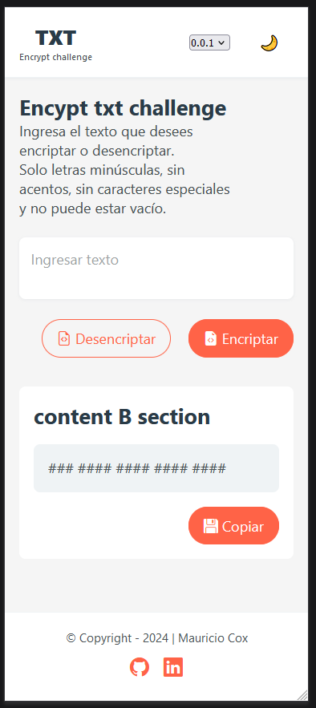
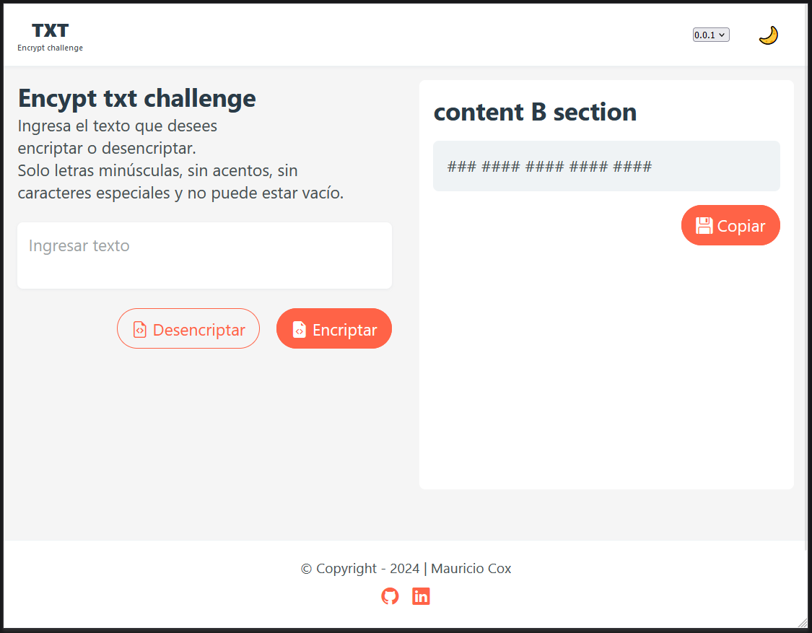
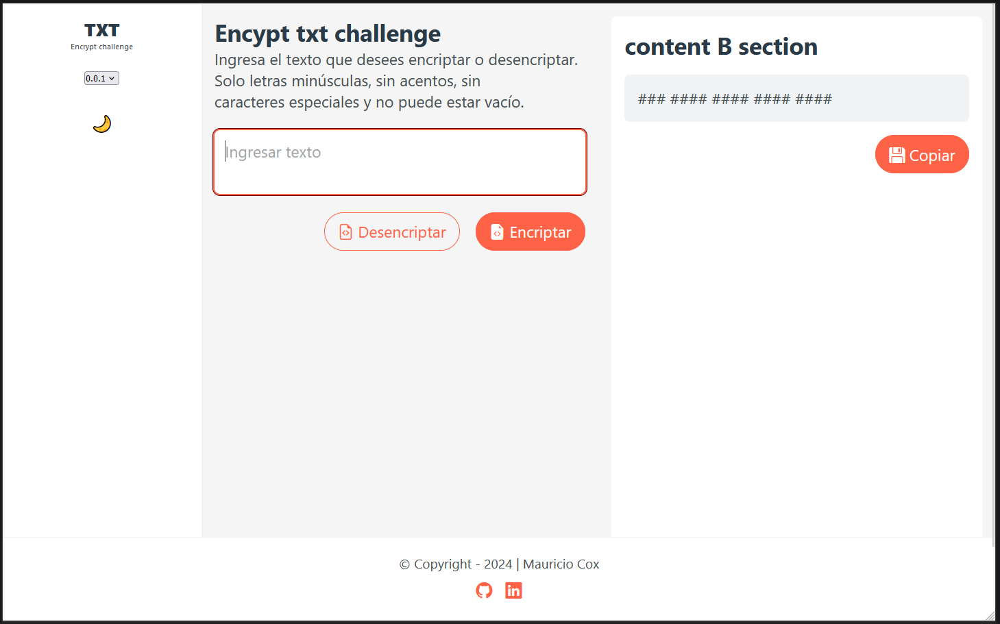

# Encrypt txt challenge
[Encrypt txt challenge repository](https://github.com/coxmau77/encrypt-txt-challenge.git) 

- Trabajo practico integrador Challenge ONE

Sprint 01: Construye un encriptador de texto con Javascript

Este desafío se desarrollo con los lenguajes HTML, CSS y Javascript sin usar frameworks.

- *CSS* >> nestingCSS, Flexbox y Grid
- **javaScript** >> Vanilla javaScript

## Recursos utilizados
_Comunidad Discord ONE G6, Google, MZDN, Bard, ChatGPT_

## Responsive
El sitio es totalmente adaptativo a cualquier dispositivo para una correcta visualizacion

## Dark mode
Tambien disponible la version dark utilizando como recurso la persistencia de la informacion en ```local Storage```

### Viewport small


### Viewport medium


### Viewport big


<small>Author: Mauricio Cox</smaill>